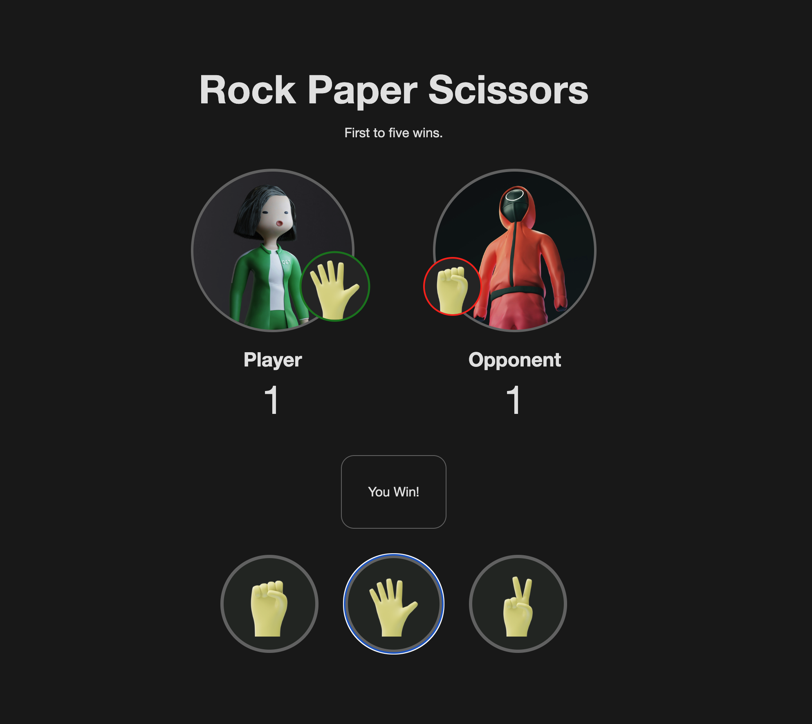

# Rock Paper Scissors

Rock Paper Scissors exercise from the Odin project using HTML, CSS & JavaScript.

[Live preview](https://nerdynischal.github.io/odin-rock-paper-scissors/)

## Acknowledgments

- [Reset CSS](https://piccalil.li/blog/a-more-modern-css-reset/)
- [awesome-readme](https://github.com/matiassingers/awesome-readme)
- [Handz](https://www.handz.design/)
- [Green tracksuit illustration by Vadim Bogulov](https://unsplash.com/photos/a-doll-with-a-green-suit-and-white-shirt-krgb_3HIkME)
- [Red tracksuit illustration by Vadim Bogulov](https://unsplash.com/photos/a-person-in-a-red-and-black-suit-jsOCj9kN-4Y)
